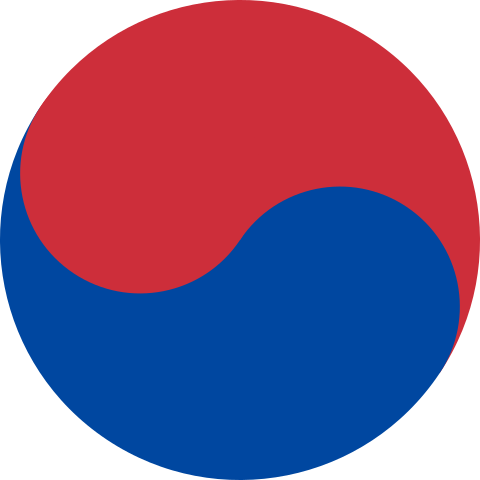

# Bienvenidos!

    
  <h3 align="center">Taegeuk</h3>
  

    Símbolo de la cultura coreana
  

Mi nombre es Jun.
Nací en Corea, pero me críe en Costa Rica.
Soy médico graduado de la Universidad de Costa Rica.
Actualmente estudio Ingeniería Eléctrica.

    
  <h3 align="center">Universidad de Costa Rica</h3>
  

    Institución Benemérita de la Educación y la Cultura Costarricense
  

En este repositorio, encontrarán mis trabajos del curso de Programación IE-0117 para el semestre I-2024.