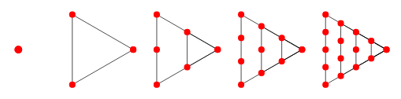
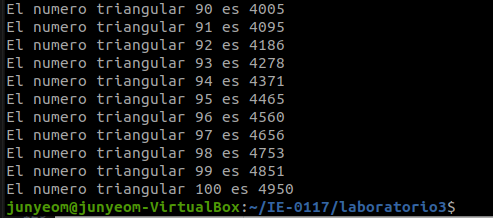
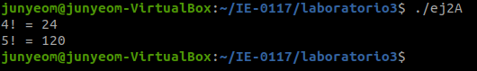

  

  <h3 align="center">Laboratorio 3</h3>

  

    Jun Hyun Yeom Song (B17326)
  

## Introducción

En este laboratorio, como prerrequisito es necesario tener un conocimiento básico de los siguientes conceptos:

* Números triangulares
* Factorial
* Matriz cuadrada

Un número triangular es un número figurado que se puede representar mediante una red triangular de puntos en donde la primera fila contiene un elemento único, y cada fila subsecuente contiene un elemento más que el anterior. Dicho en términos más formales, un número triangular es un número obtenido meidante la suma de todos los enteros positivos menores o igual que un número entero positivo *n*.

  
  <h4 align="center">Figura 1. Ilustración de números triangulares.</h4>

El factorial de un número entero positivo n se define mediante la siguiente expresión:

$$n!=n(n-1)(n-2)...(2)(1)$$

En otras palabras, el factorial n! es la multiplicación de todos los números enteros positivos menores o igual que n.

Una matriz es un arreglo de datos con importantes aplicaciones en diversos ámbitos académicos y profesionales. Una matriz de dos dimensiones *m x n* está constituida por *m* filas y *n* columnas. Si se cumple que $m=n$, se dice que la matriz es cuadrada.

## Implementación

### Ejercicio 1

Una manera de abordar este problema es mediante el uso de un ciclo for. Los ciclos for reciben:

* Una condición inicial
* Una condición de salida
* Un iterador

Se conoce que el primer número triangular es cero:

$$T_{1}=0$$

Como el primer elemento es un 0, es conveniente iniciar el ciclo con un 0. Además, es conveniente declarar una variable que vaya almacenando la suma de todos los elementos menores o igual que n. La condición de salida ocurre cuando se encuentren los primeros 100 números triangulares.

Para obtener el segundo número triangular, al primer número triangular se le suma el primer número triangular más 1. Entonces:

$$T_{2}=0+1=1$$

Para obtener el tercer número triangular, a la suma del primer número triangular más el segundo número triangular se le suma el segundo número triangular más 1. Entonces:

$$T_{3}=T_{1}+T_{2}+(T_{2}+1)=0+1+2=3$$

Para ilustrar que la secuencia no es una función rectilínea, se obtiene el cuarto número triangular:

$$T_{4}=T_{1}+T_{2}+T_{3}+(T_{3}+1)=0+1+2+3=6$$

Así sucesivamente hasta obtener $T_{100}$.

En C, el operador ++ permite ir guardando el resultado de las sumas previas en una variable, por lo que al utilizarlo dentro del ciclo for, es posible implementar en código la idea descrita anteriormente.

### Ejercicio 2

Si el objetivo del ejercicio 1 era diseñar, el objetivo del ejercicio 2 es identificar el error. El código del enunciado contiene una función *factorial* y un main que la llama. Al inspeccionar la función, es posible concluir que la lógica está bien construida, aunque esto no la exima de pruebas para verificar su ejecución.

Al leer el main, el primer detalle a notar es que recibe argumentos de tipo argc y argv. Cabe recordar que **argc** es un número entero positivo que contiene la cantidad de argumentos de argv, mientras que **argv** es un arreglo de strings que representan los argumentos ingresados por el usuario en la línea de comando; el primer elemento de dicho arreglo es el nombre de archivo.

Sin embargo, en el main ya se le pasaron enteros positivos a la función *factorial*, por lo que argc y argv no son necesarios. Incluso, en lugar de pasarle enteros positivos directamente a la función *factorial*, es posible mediante scanf solicitarle un número al usuario, y utilizar dicho número como argumento.

### Ejercicio 3

Una matriz de dos dimensiones se puede recorrer con dos ciclos for; el primer ciclo recorre cada fila, mientras que el segundo ciclo recorre cada columna. El problema solicita calcular el tamaño del cuadrado de 1s más grande dentro de la matriz. Al resolver problemas de programación, es útil segmentar el problema principal e implementar un algoritmo "en papel" para cada segmento antes de construir la solución. 

En este caso, se podría decir que, como prerrequisito de tener un cuadrado de 1s, es necesario verificar la existencia de por lo menos un 1 en la matriz. Tras cumplir esta condición, seguiría buscar filas sin interrumpir de 1s fila por fila hasta inspeccionar toda la matriz. Así, por cada fila es posible obtener la fila sin interrumpir más grande de 1s. Una posible manera de implementar este algoritmo en código es mediante el uso de if, y si se van cumpliendo las condiciones mencionadas, un contador irá guardando el tamaño de la fila sin interrumpir más grande de 1s.

||C1|C2|C3|C4|C5||
|---|---|---|---|---|---|---|
|F1|0|1|1|1|0|3|
|F2|0|1|1|1|1|4|
|F3|1|1|1|1|0|4|
|F4|0|1|1|0|1|2|
|F5|1|0|1|0|1|1|

Sin embargo, esto no es suficiente para encontrar un cuadrado de 1s porque las filas de 1s pueden estar desalineadas una de la otra. Por lo tanto, es necesario conservar la información de la coordenada en donde se encontró la fila sin interrumpir más grande de 1s. Para esto, es conveniente utilizar una matriz auxiliar de 0s del mismo tamaño que la matriz principal, en la cual se vaya guardando el tamaño de la fila de 1s más grande que se vaya encontrando en la matriz principal. Así, se cumple el objetivo de conservar la coordenada de cada fila de 1s.

||C1|C2|C3|C4|C5|
|---|---|---|---|---|---|
|F1|0|1|2|3|0|
|F2|0|1|2|3|4|
|F3|1|2|3|4|0|
|F4|0|1|2|0|1|
|F5|1|0|1|0|1|

Tras obtener la matrix auxiliar, se recorre con dos ciclos for para buscar elemento por elemento la columna de tamaños sin interrumpir más grande posible. 

Por ejemplo, si en la matriz auxiliar el ciclo encuentra un 2, debe buscar un elemento mayor o igual que 2 arriba o abajo. Si lo encuentra, quiere decir que existe por lo menos un cuadrado de 1s de 2x2. En (F1, C3), se ha encontrado un 2, por lo que debe buscar otro elemento mayor o igual que 2 arriba o abajo. En (F2, C3) se ha encontrado otro 2, por lo que existe por lo menos un cuadrado de 1s de 2x2. Como se ha encontrado un 2 en (F2, C3), el algoritmo busca otro elemento mayor o igual que 2 arriba (F1, C3) o abajo (F3, C3), y como se encuentra un 3 en (F3, C3), se ha encontrado otro cuadrado de 1s de 2x2.

Si encuentra un 3, debe buscar un elemento mayor o igual que 3 arriba o abajo, y otro elemento mayor o igual que 3 contiguo al par de 3 que se encontró. Si se cumplen estos criterios, se ha encontrado un cuadrado de 1s de 3x3. En (F1, C4), se ha encontrado un 3. El algoritmo buscará otro elemento mayor o igual que 3 arriba o abajo. Se ha encontrado un 3 en (F2, C4). Prosigue con la búsqueda de otro elemento mayor o igual que 3 en una celda contigua al par de 3 que se encontró. Se ha encontrado un 4 en (F3, C4), con el cual se concluye que existe un cuadrado de 1s de 3x3.

Es decir, si el ciclo se encuentra un *n*, debe encontrar una cantidad *n* de elementos mayores o iguales que *n* contiguos en la columna.

## Resultados

### Ejercicio 1

Al compilar el archivo ej1.c y correr el ejecutable, se obtiene el siguiente resultado en la línea de comando:

  
  <h4 align="center">Figura 2. Primeros 10 números triangulares de la secuencia.</h4>

Para no mostrar todos los 100 números, se muestran los primeros 10 y los últimos 10 números triangulares de la secuencia ejecutada.

  
  <h4 align="center">Figura 3. Últimos 100 números triangulares de la secuencia.</h4>

### Ejercicio 2

Al compilar el archivo ej2A.c y correr el ejecutable, se obtiene el siguiente resultado en la línea de comando:

  
  <h4 align="center">Figura 4. Ejecución de ej2A.c.</h4>

Se ha corregido el error y el código ejecuta su tarea correctamente.

Al compilar el archivo ej2B.c y correr el ejecutable, se obtiene el siguiente resultado en la línea de comando:

  
  <h4 align="center">Figura 5. Ejecución de ej2B.c.</h4>

Tras haber corregido el error, se implementó exitosamente un scanf para solicitarle al usuario el número al cual se le calculará el factorial.

### Ejercicio 3

Al compilar el archivo ej3A.c y correr el ejecutable, se obtiene el siguiente resultado en la línea de comando:

  
  <h4 align="center">Figura 6. Ejecución de ej3A.c.</h4>

## Conclusiones

