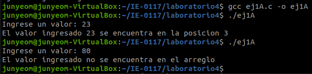
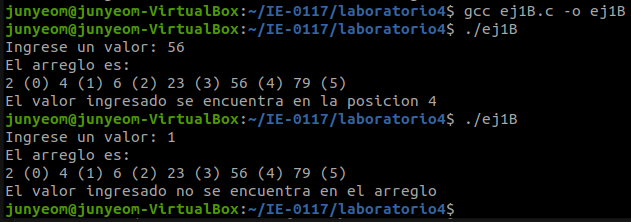
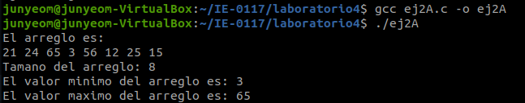
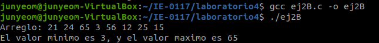

  

  <h3 align="center">Laboratorio 4</h3>

  

    Jun Hyun Yeom Song (B17326)
  

## Introducción

En este laboratorio, como prerrequisito es necesario tener un conocimiento básico de los siguientes conceptos:

## Implementación

### Ejercicio 1

### Ejercicio 2

## Resultados

### Ejercicio 1

Al compilar el archivo ej1A.c y correr el ejecutable, se obtiene el siguiente resultado en la línea de comando:

  
  <h4 align="center">Figura 1.</h4>

Al compilar el archivo ej1B.c y correr el ejecutable, se obtiene el siguiente resultado en la línea de comando:

  
  <h4 align="center">Figura 2. </h4>

### Ejercicio 2

Al compilar el archivo ej2A.c y correr el ejecutable, se obtiene el siguiente resultado en la línea de comando:

  
  <h4 align="center">Figura 3.</h4>

Al compilar el archivo ej2B.c y correr el ejecutable, se obtiene el siguiente resultado en la línea de comando:

  
  <h4 align="center">Figura 4. </h4>

Al compilar el archivo ej2C.c y correr el ejecutable, se obtiene el siguiente resultado en la línea de comando:

  
  <h4 align="center">Figura 5. </h4>

## Conclusiones

