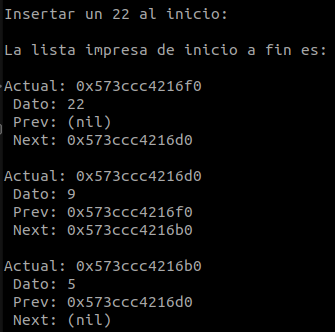

  

  <h3 align="center">Laboratorio 5</h3>

  

    Jun Hyun Yeom Song (B17326)
  

## Introducción

En este laboratorio, se exploran los siguientes conceptos:

* Memoria dinámica
* Listas doblemente enlazadas

La asignación de memoria estática ocurre durante el compile time. En contraste, la asignación de **memoria dinámica** ocurre durante el runtime; esto permite que la memoria utilizada por un programa varíe de tamaño durante su ejecución. En el lenguaje C, esto se aplica mediante cuatro funciones de stdlib.h: (1)

|Función|Descripción|
|---|---|
|malloc()|Asigna un único bloque de memoria solicitada|
|calloc()|Asigna múltiples bloques de memoria socilitada|
|realloc()|Reasigna la memoria ocupada por malloc() y calloc()|
|free()|Libera la memoria asignada dinámicamente|

Una **lista doblemente enlazada** es un tipo de lista enlazada en la cual cada uno de sus nodos contiene un dato, un puntero al nodo previo, y un puntero al nodo siguiente. Esta estructura de datos es un ejemplo representativo de memoria dinámica. (2)

## Implementación

En este laboratorio, se ha implementado las siguientes operaciones aplicadas en una lista doblemente enlazada:

* Insertar un nodo al inicio (**insertBeginning**)
* Insertar un nodo al final (**insertEnding**)
* Insertar un nodo en un índice específico (**insertAtIndex**)
* Eliminar el primer nodo duplicado (**deleteDuplicate**)
* Buscar un dato específico (**searchData**)
* Recorrer la lista hacia adelante e imprimirla (**printListForward**)
* Recorrer la lista hacia atrás e imprimirla (**printListBackward**)

Además, se implementó una función **freeList** para liberar la memoria asignada dinámicamente y evitar memory leaks.

*A continuación se describe de modo general la implementación de cada función. Para conocer cómo se implementó cada función de modo más específico, seleccione el archivo "double_list.c", donde la documentación del código explica más detalladamente la implementación de cada función.*

La función insertBeginning recibe un dato y un puntero doble que apunta al primer elemento de la lista doblemente enlazada. Inserta un nuevo nodo al inicio de la lista y actualiza el head de la lista. Siempre que se invoque esta función, el head de la lista se actualiza.

La función insertEnding recibe un dato y un puntero doble que apunta al primer elemento de la lista doblemente enlazada. A diferencia de insertBeginning, insertEnding recorre toda la lista hasta encontrar el último nodo. Seguidamente, inserta un nuevo nodo.

La función insertAtIndex recibe un índice, un dato y un puntero doble que apunta al primer elemento de la lista doblemente enlazada. insertAtIndex utiliza el índice para insertar un nuevo nodo inmediatamente después del nodo con el índice especificado.

La función deleteDuplicate recibe un puntero doble que apunta al primer elemento de la lista doblemente enlazada. En la función, se crean dos punteros para recorrer la lista. El puntero "actual" se detiene en cada elemento de la lista, mientras que el puntero "scan" apunta uno por uno a los elementos que se ubican a la derecha del elemento actual, y la función procede a compararlos.

La función searchData recibe un dato y un puntero doble que apunta al primer elemento de la lista doblemente enlazada. Busca el dato especificado en la lista, y si lo encuentra, imprime la posición donde se encuentra dicho dato.

printListForward recorre e imprime la lista resultante de inicio a fin, mientras que printListBackward la imprime de fin a inicio. En estas funciones, se ha incluido la impresión de las direcciones de los nodos y sus lazos para visualizar la conexión entre los nodos.

## Resultados

Al ejecutar el comando make en la terminal, se compilan los archivos utilizando el archivo Makefile, y se genera un ejecutable llamado main.

Al ejecutar main, se obtienen los siguientes resultados:

  
  <h4 align="center">Figura 1. Inserción de un 5 al inicio de la lista.</h4>

  
  <h4 align="center">Figura 2. Inserción de un 9 al inicio de la lista.</h4>

  
  <h4 align="center">Figura 3. Inserción de un 22 al inicio de la lista.</h4>

Se ha logrado demostrar exitosamente la funcionalidad de insertBeginning. Se aprecia que insertBeginning respeta el orden de los nodos, y actualiza el nodo que encabeza la lista.

  
  <h4 align="center">Figura 4. Inserción de un 100 al final de la lista. </h4>

  
  <h4 align="center">Figura 5. Inserción de un 236 al final de la lista.</h4>

Se ha logrado demostrar exitosamente la funcionalidad de insertEnding. Esta función también respeta el orden de los nodos. En este caso, no es necesario actualizar el nodo que encabeza la lista.

  
  <h4 align="center">Figura 6. Inserción de un 50 inmediatamente después del nodo índice 1.</h4>

El nodo índice 1 es el nodo que contiene al 9. insertAtIndex inserta un 50 inmediatamente después de dicho nodo.

  
  <h4 align="center">Figura 7. Inserción de un 100 inmediatamente después del nodo índice 3.</h4>

El nodo índice 3 es el nodo que contiene al 5. insertAtIndex inserta un 100 inmediatamente después de dicho nodo.

  
  <h4 align="center">Figura 8. Eliminación del nodo duplicado.</h4>

Tras la operación de eliminación, se aprecia el recorrido e impresión hacia adelante de la lista resultante.

  
  <h4 align="center">Figura 9. Recorrido e impresión hacia atrás de la lista resultante.</h4>

  
  <h4 align="center">Figura 10. Búsqueda de elementos en la lista.</h4>

Como 22 sí está en la lista, el programa imprime su posición.
Como 23 no está en la lista, imprime un mensaje de no encontrado.

## Conclusiones

* La memoria dinámica optimiza el uso de la memoria haciendo máximo uso de los recursos disponibles y evitando memory leaks
* Las listas doblemente enlazadas integran la aplicación de diferentes conceptos: punteros, listas enlazadas, memoria dinámica y operaciones lógico-aritméticas.

## Referencias

1. JavaTPoint. Dynamic Memory Allocation in C. Accesado el 4 de junio del 2024 en https://www.javatpoint.com/dynamic-memory-allocation-in-c
2. JavaTPoint. Doubly Linked List in C. Accesado el 4 de junio del 2024 en https://www.javatpoint.com/doubly-linked-list