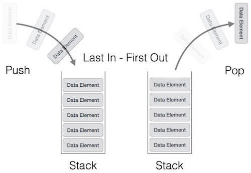

  

  <h3 align="center">Laboratorio 6</h3>

  

    Jun Hyun Yeom Song (B17326)
  

## Introducción

En este laboratorio, se exploran los siguientes conceptos:

* Stack

El **stack** (o **pila** en español) es una estructura de datos lineal en el cual los datos se almacenan utilizando el principio de Last In First Out (LIFO), es decir, el último dato en entrar es el primer dato en salir. Se puede representar utilizando arrays, para implementar un stack de tamaño estático, o utilizando listas, para implementar un stack de tamaño dinámico. En este laboratorio se ha implementado un stack utilizando listas doblemente enlazadas.

  
  <h4 align="center">Figura 1. Ilustración del stack.</h4>

## Implementación

Se solicita la implementación de las siguientes funciones:

* push()
* pop()
* peek()
* isEmpty()

Adicionalmente, se solicita la impresión de la lista (printStack) para demostrar la funcionalidad de las funciones, y una función que libere la memoria asignada para evitar memory leaks (freeStack).

# push()

Esta función requiere dos parámetros: un puntero doble que apunte al nodo de referencia, y el dato que será ingresado a la lista.

## Resultados

Al ejecutar el comando make en la terminal, se compilan los archivos utilizando el archivo Makefile, y se genera un ejecutable llamado main.

Al ejecutar main, se obtienen los siguientes resultados:

  
  <h4 align="center">Figura 2. Primera ejecución de la función isEmpty.</h4>

  
  <h4 align="center">Figura 3. Cuatro ejecuciones consecutivas de la función push.</h4>

  
  <h4 align="center">Figura 4. Ejecuciones alternantes de las funciones peek y pop.</h4>

  
  <h4 align="center">Figura 5. Segunda ejecución de la función isEmpty.</h4>

  
  <h4 align="center">Figura 6. Impresión de la lista resultante.</h4>

  
  <h4 align="center">Figura 7. Tercera ejecución de la función isEmpty.</h4>

  
  <h4 align="center">Figura 8. Ejecución de valgrind.</h4>

Finalmente, al ejecutar valgrind, se evidencia que este programa no tiene memory leaks.

## Conclusiones

* 

## Referencias

1. Tutorials Point. Accesado el 12 de junio del 2024 en https://www.tutorialspoint.com/data_structures_algorithms/stack_algorithm.htm